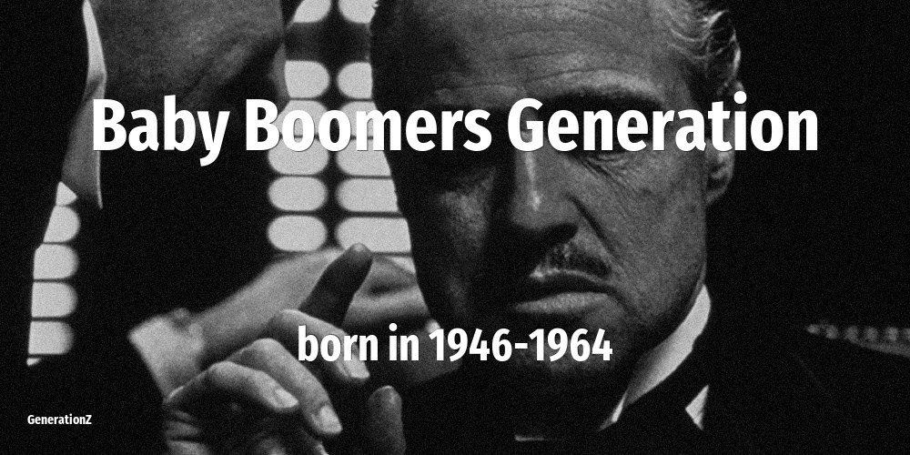

# Baby Boomers

| Previous | This Generation | Born in | Ages in 2026 | Next |
|---|---|---|---|---|
| [Silent Generation](../silent-generation/index.md) | **Baby Boomers, Boomers** | 1946–1964 | 62–80 year old | [Generation X](../generation-x/index.md) |

## How old the Baby Boomers were at key moments

The age of this cohort when each defining event happened.

| Year | Event | Their age |
|---|---|---|
| 1960 | [In Japan, NHK and NTV introduces color television](../../events/in-japan-nhk-and-ntv-introduces-color-television.md) | newborn–14 |
| 1963 | [John F Kennedy is assassinated](../../events/john-f-kennedy-is-assassinated.md) | newborn–17 |
| 1973 | [Roe vs Wade: the right to have an abortion](../../events/roe-vs-wade-the-right-to-have-an-abortion.md) | 9–27 |
| 1974 | [Nixon resigns over Watergate scandal](../../events/nixon-resigns-over-watergate-scandal.md) | 10–28 |
| 1980 | [John Lennon is killed on the streets of NYC](../../events/john-lennon-is-killed-on-the-streets-of-nyc.md) | 16–34 |
| 1986 | [Chernobyl nuclear disaster](../../events/chernobyl-nuclear-disaster.md) | 22–40 |
| 1989 | [Fall of the Berlin Wall](../../events/fall-of-the-berlin-wall.md) | 25–43 |
| 2001 | [September 11 attacks](../../events/september-11-attacks.md) | 37–55 |
| 2007 | [Apple launches the first iPhone](../../events/apple-launches-the-first-iphone.md) | 43–61 |
| 2011 | [Fukushima nuclear disaster](../../events/fukushima-nuclear-disaster.md) | 47–65 |
| 2020 | [WHO declares COVID-19 a global pandemic. Start of a wave of lockdowns.](../../events/who-declares-covid-19-a-global-pandemic-start-of-a-wave-of-lockdowns.md) | 56–74 |

## On this generation

[Notable people of Baby Boomers](famous-people.md) (21)

- [Actors that belong to Baby Boomers](actor.md) (4)
- [Comedians that belong to Baby Boomers](comedian.md) (2)
- [Directors that belong to Baby Boomers](director.md) (3)
- [Musicians that belong to Baby Boomers](musician.md) (4)
- [Politicians that belong to Baby Boomers](politics.md) (8)
- [Memorable quotes about Baby Boomers](quotes.md)
- [Detailed Timeline of defining events](timeline.md)

## Frequently asked questions

### When were the Baby Boomers born?

The Baby Boomers were born between 1946 and 1964.

### How old are the Baby Boomers in 2026?

In 2026 the Baby Boomers are 62–80 years old.

### What generation comes after the Baby Boomers?

The Generation X (born 1965–1980) come after the Baby Boomers.

### What generation came before the Baby Boomers?

The Silent Generation (born 1925–1945) came before the Baby Boomers.

----

_Last updated: 2026-06-17_
