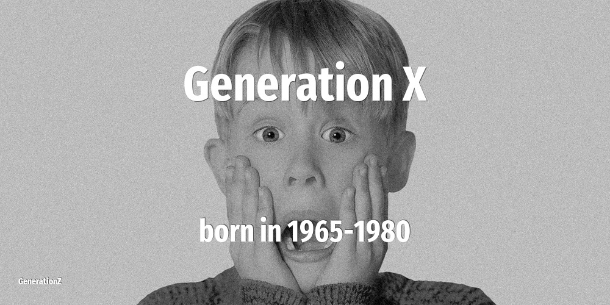

# Generation X

| Previous | This Generation | Born in | Ages in 2026 | Next |
|---|---|---|---|---|
| [Baby Boomers](../baby-boomers/index.md) | **Generation X, Baby Bust, Gen X** | 1965–1980 | 46–61 year old | [Generation Y](../millennials/index.md) |

## How old the Generation X were at key moments

The age of this cohort when each defining event happened.

| Year | Event | Their age |
|---|---|---|
| 1973 | [Roe vs Wade: the right to have an abortion](../../events/roe-vs-wade-the-right-to-have-an-abortion.md) | newborn–8 |
| 1974 | [Nixon resigns over Watergate scandal](../../events/nixon-resigns-over-watergate-scandal.md) | newborn–9 |
| 1980 | [John Lennon is killed on the streets of NYC](../../events/john-lennon-is-killed-on-the-streets-of-nyc.md) | newborn–15 |
| 1986 | [Chernobyl nuclear disaster](../../events/chernobyl-nuclear-disaster.md) | 6–21 |
| 1989 | [Fall of the Berlin Wall](../../events/fall-of-the-berlin-wall.md) | 9–24 |
| 2001 | [September 11 attacks](../../events/september-11-attacks.md) | 21–36 |
| 2007 | [Apple launches the first iPhone](../../events/apple-launches-the-first-iphone.md) | 27–42 |
| 2011 | [Fukushima nuclear disaster](../../events/fukushima-nuclear-disaster.md) | 31–46 |
| 2020 | [WHO declares COVID-19 a global pandemic. Start of a wave of lockdowns.](../../events/who-declares-covid-19-a-global-pandemic-start-of-a-wave-of-lockdowns.md) | 40–55 |

## On this generation

[Notable people of Generation X](famous-people.md) (19)

- [Actors that belong to Generation X](actor.md) (10)
- [Comedians that belong to Generation X](comedian.md) (1)
- [Directors that belong to Generation X](director.md) (1)
- [Musicians that belong to Generation X](musician.md) (3)
- [Personalities that belong to Generation X](personality.md) (1)
- [Politicians that belong to Generation X](politics.md) (3)
- [Memorable quotes about Generation X](quotes.md)
- [Detailed Timeline of defining events](timeline.md)

## Frequently asked questions

### When were the Generation X born?

The Generation X were born between 1965 and 1980.

### How old are the Generation X in 2026?

In 2026 the Generation X are 46–61 years old.

### What generation comes after the Generation X?

The Generation Y (born 1981–1996) come after the Generation X.

### What generation came before the Generation X?

The Baby Boomers (born 1946–1964) came before the Generation X.

----

_Last updated: 2026-06-04_
