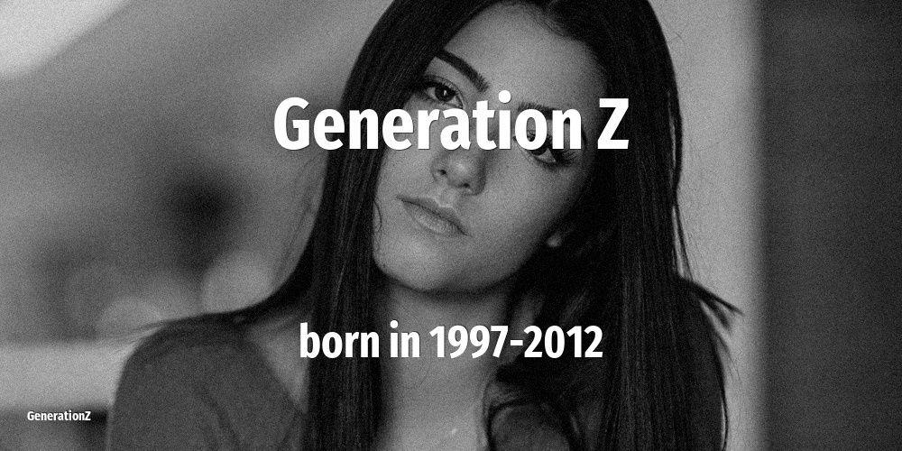

# Generation Z

| Previous | This Generation | Born in | Ages in 2026 | Next |
|---|---|---|---|---|
| [Generation Y](../millennials/index.md) | **Generation Z, Gen-Z, Digital Natives, Centennials, Post-Millennials** | 1997–2012 | 14–29 year old | [Generation Alpha](../generation-alpha/index.md) |

## How old the Generation Z were at key moments

The age of this cohort when each defining event happened.

| Year | Event | Their age |
|---|---|---|
| 2001 | [September 11 attacks](../../events/september-11-attacks.md) | newborn–4 |
| 2007 | [Apple launches the first iPhone](../../events/apple-launches-the-first-iphone.md) | newborn–10 |
| 2011 | [Fukushima nuclear disaster](../../events/fukushima-nuclear-disaster.md) | newborn–14 |
| 2020 | [WHO declares COVID-19 a global pandemic. Start of a wave of lockdowns.](../../events/who-declares-covid-19-a-global-pandemic-start-of-a-wave-of-lockdowns.md) | 8–23 |

## On this generation

[Notable people of Generation Z](famous-people.md) (5)

- [Actors that belong to Generation Z](actor.md) (2)
- [Musicians that belong to Generation Z](musician.md) (1)
- [Personalities that belong to Generation Z](personality.md) (1)
- [Politicians that belong to Generation Z](politics.md) (1)
- [Memorable quotes about Generation Z](quotes.md)
- [Detailed Timeline of defining events](timeline.md)

## Frequently asked questions

### When were the Generation Z born?

The Generation Z were born between 1997 and 2012.

### How old are the Generation Z in 2026?

In 2026 the Generation Z are 14–29 years old.

### What generation comes after the Generation Z?

The Generation Alpha (born 2013–2024) come after the Generation Z.

### What generation came before the Generation Z?

The Generation Y (born 1981–1996) came before the Generation Z.

----

_Last updated: 2026-06-17_
