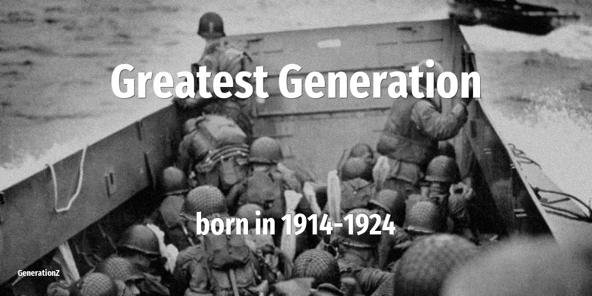

# Greatest Generation

| Previous | This Generation | Born in | Ages in 2026 | Next |
|---|---|---|---|---|
| [Interbellum Generation](../interbellum-generation/index.md) | **Greatest Generation** | 1914–1924 | 102–112 year old | [Silent Generation](../silent-generation/index.md) |

## How old the Greatest Generation were at key moments

The age of this cohort when each defining event happened.

| Year | Event | Their age |
|---|---|---|
| 1960 | [In Japan, NHK and NTV introduces color television](../../events/in-japan-nhk-and-ntv-introduces-color-television.md) | 36–46 |
| 1963 | [John F Kennedy is assassinated](../../events/john-f-kennedy-is-assassinated.md) | 39–49 |
| 1973 | [Roe vs Wade: the right to have an abortion](../../events/roe-vs-wade-the-right-to-have-an-abortion.md) | 49–59 |
| 1974 | [Nixon resigns over Watergate scandal](../../events/nixon-resigns-over-watergate-scandal.md) | 50–60 |
| 1980 | [John Lennon is killed on the streets of NYC](../../events/john-lennon-is-killed-on-the-streets-of-nyc.md) | 56–66 |
| 1986 | [Chernobyl nuclear disaster](../../events/chernobyl-nuclear-disaster.md) | 62–72 |
| 1989 | [Fall of the Berlin Wall](../../events/fall-of-the-berlin-wall.md) | 65–75 |
| 2001 | [September 11 attacks](../../events/september-11-attacks.md) | 77–87 |
| 2007 | [Apple launches the first iPhone](../../events/apple-launches-the-first-iphone.md) | 83–93 |
| 2011 | [Fukushima nuclear disaster](../../events/fukushima-nuclear-disaster.md) | 87–97 |
| 2020 | [WHO declares COVID-19 a global pandemic. Start of a wave of lockdowns.](../../events/who-declares-covid-19-a-global-pandemic-start-of-a-wave-of-lockdowns.md) | 96–106 |

## On this generation

[Notable people of Greatest Generation](famous-people.md) (6)

- [Actors that belong to Greatest Generation](actor.md) (1)
- [Politicians that belong to Greatest Generation](politics.md) (4)
- [Religious figures that belong to Greatest Generation](religion.md) (1)
- [Memorable quotes about Greatest Generation](quotes.md)
- [Detailed Timeline of defining events](timeline.md)

## Frequently asked questions

### When were the Greatest Generation born?

The Greatest Generation were born between 1914 and 1924.

### How old are the Greatest Generation in 2026?

In 2026 the Greatest Generation are 102–112 years old.

### What generation comes after the Greatest Generation?

The Silent Generation (born 1925–1945) come after the Greatest Generation.

### What generation came before the Greatest Generation?

The Interbellum Generation (born 1901–1913) came before the Greatest Generation.

### How many notable people were born in the Greatest Generation?

This site lists 6 notable people born in the Greatest Generation.

----

_Last updated: 2026-06-04_
