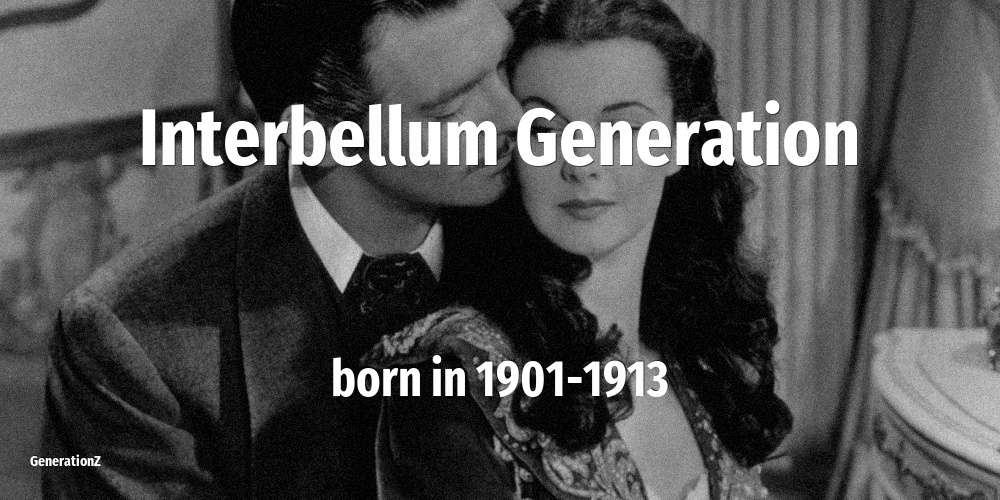

# Interbellum Generation

| Previous | This Generation | Born in | Ages in 2026 | Next |
|---|---|---|---|---|
| [Lost Generation](../lost-generation/index.md) | **Interbellum Generation** | 1901–1913 | 113–125 year old | [Greatest Generation](../greatest-generation/index.md) |

## How old the Interbellum Generation were at key moments

The age of this cohort when each defining event happened.

| Year | Event | Their age |
|---|---|---|
| 1960 | [In Japan, NHK and NTV introduces color television](../../events/in-japan-nhk-and-ntv-introduces-color-television.md) | 47–59 |
| 1963 | [John F Kennedy is assassinated](../../events/john-f-kennedy-is-assassinated.md) | 50–62 |
| 1973 | [Roe vs Wade: the right to have an abortion](../../events/roe-vs-wade-the-right-to-have-an-abortion.md) | 60–72 |
| 1974 | [Nixon resigns over Watergate scandal](../../events/nixon-resigns-over-watergate-scandal.md) | 61–73 |
| 1980 | [John Lennon is killed on the streets of NYC](../../events/john-lennon-is-killed-on-the-streets-of-nyc.md) | 67–79 |
| 1986 | [Chernobyl nuclear disaster](../../events/chernobyl-nuclear-disaster.md) | 73–85 |
| 1989 | [Fall of the Berlin Wall](../../events/fall-of-the-berlin-wall.md) | 76–88 |
| 2001 | [September 11 attacks](../../events/september-11-attacks.md) | 88–100 |
| 2007 | [Apple launches the first iPhone](../../events/apple-launches-the-first-iphone.md) | 94–106 |
| 2011 | [Fukushima nuclear disaster](../../events/fukushima-nuclear-disaster.md) | 98–110 |

## On this generation

[Notable people of Interbellum Generation](famous-people.md) (2)

- [Politicians that belong to Interbellum Generation](politics.md) (2)
- [Memorable quotes about Interbellum Generation](quotes.md)
- [Detailed Timeline of defining events](timeline.md)

## Frequently asked questions

### When were the Interbellum Generation born?

The Interbellum Generation were born between 1901 and 1913.

### How old are the Interbellum Generation in 2026?

In 2026 the Interbellum Generation are 113–125 years old.

### What generation comes after the Interbellum Generation?

The Greatest Generation (born 1914–1924) come after the Interbellum Generation.

### What generation came before the Interbellum Generation?

The Lost Generation (born 1883–1900) came before the Interbellum Generation.

### How many notable people were born in the Interbellum Generation?

This site lists 2 notable people born in the Interbellum Generation.

----

_Last updated: 2026-06-04_
