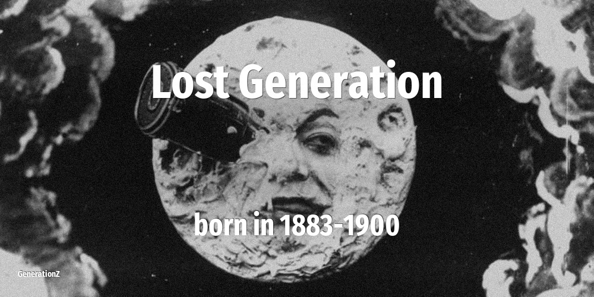

# Lost Generation

| Previous | This Generation | Born in | Ages in 2026 | Next |
|---|---|---|---|---|
|  | **Lost Generation** | 1883–1900 | 126–143 year old | [Interbellum Generation](../interbellum-generation/index.md) |

## How old the Lost Generation were at key moments

The age of this cohort when each defining event happened.

| Year | Event | Their age |
|---|---|---|
| 1960 | [In Japan, NHK and NTV introduces color television](../../events/in-japan-nhk-and-ntv-introduces-color-television.md) | 60–77 |
| 1963 | [John F Kennedy is assassinated](../../events/john-f-kennedy-is-assassinated.md) | 63–80 |
| 1973 | [Roe vs Wade: the right to have an abortion](../../events/roe-vs-wade-the-right-to-have-an-abortion.md) | 73–90 |
| 1974 | [Nixon resigns over Watergate scandal](../../events/nixon-resigns-over-watergate-scandal.md) | 74–91 |
| 1980 | [John Lennon is killed on the streets of NYC](../../events/john-lennon-is-killed-on-the-streets-of-nyc.md) | 80–97 |
| 1986 | [Chernobyl nuclear disaster](../../events/chernobyl-nuclear-disaster.md) | 86–103 |
| 1989 | [Fall of the Berlin Wall](../../events/fall-of-the-berlin-wall.md) | 89–106 |

## On this generation

[Notable people of Lost Generation](famous-people.md) (1)

- [Religious figures that belong to Lost Generation](religion.md) (1)
- [Memorable quotes about Lost Generation](quotes.md)
- [Detailed Timeline of defining events](timeline.md)

## Frequently asked questions

### When were the Lost Generation born?

The Lost Generation were born between 1883 and 1900.

### How old are the Lost Generation in 2026?

In 2026 the Lost Generation are 126–143 years old.

### What generation comes after the Lost Generation?

The Interbellum Generation (born 1901–1913) come after the Lost Generation.

### What generation came before the Lost Generation?

The Lost Generation are the oldest named generation on this site.

----

_Last updated: 2026-06-17_
