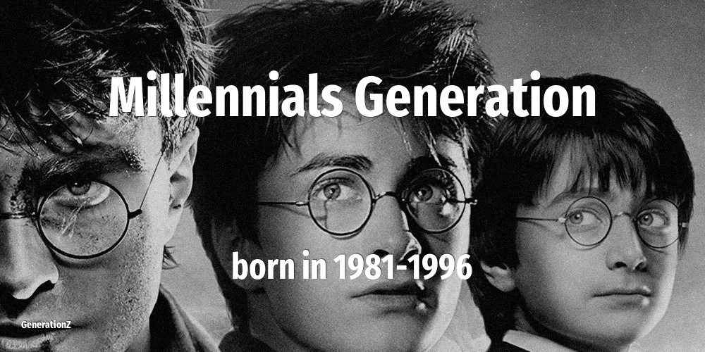

# Generation Y

| Previous | This Generation | Born in | Ages in 2026 | Next |
|---|---|---|---|---|
| [Generation X](../generation-x/index.md) | **Generation Y, millennials** | 1981–1996 | 30–45 year old | [Generation Z](../generation-z/index.md) |

## How old the Generation Y were at key moments

The age of this cohort when each defining event happened.

| Year | Event | Their age |
|---|---|---|
| 1986 | [Chernobyl nuclear disaster](../../events/chernobyl-nuclear-disaster.md) | newborn–5 |
| 1989 | [Fall of the Berlin Wall](../../events/fall-of-the-berlin-wall.md) | newborn–8 |
| 2001 | [September 11 attacks](../../events/september-11-attacks.md) | 5–20 |
| 2007 | [Apple launches the first iPhone](../../events/apple-launches-the-first-iphone.md) | 11–26 |
| 2011 | [Fukushima nuclear disaster](../../events/fukushima-nuclear-disaster.md) | 15–30 |
| 2020 | [WHO declares COVID-19 a global pandemic. Start of a wave of lockdowns.](../../events/who-declares-covid-19-a-global-pandemic-start-of-a-wave-of-lockdowns.md) | 24–39 |

## On this generation

[Notable people of Generation Y](famous-people.md) (19)

- [Actors that belong to Generation Y](actor.md) (10)
- [Comedians that belong to Generation Y](comedian.md) (2)
- [Musicians that belong to Generation Y](musician.md) (5)
- [Personalities that belong to Generation Y](personality.md) (1)
- [Politicians that belong to Generation Y](politics.md) (1)
- [Memorable quotes about Generation Y](quotes.md)
- [Detailed Timeline of defining events](timeline.md)

## Frequently asked questions

### When were the Generation Y born?

The Generation Y were born between 1981 and 1996.

### How old are the Generation Y in 2026?

In 2026 the Generation Y are 30–45 years old.

### What generation comes after the Generation Y?

The Generation Z (born 1997–2012) come after the Generation Y.

### What generation came before the Generation Y?

The Generation X (born 1965–1980) came before the Generation Y.

----

_Last updated: 2026-06-17_
