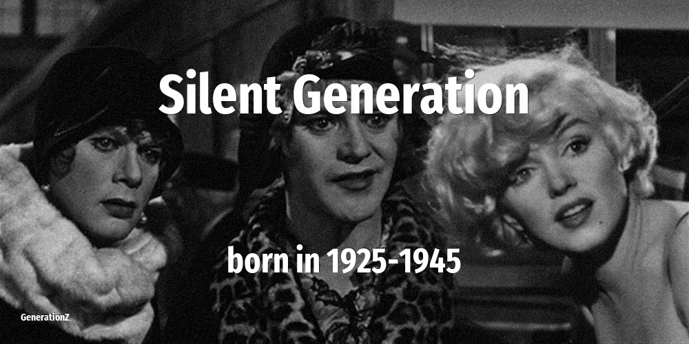

# Silent Generation

| Previous | This Generation | Born in | Ages in 2026 | Next |
|---|---|---|---|---|
| [Greatest Generation](../greatest-generation/index.md) | **Silent Generation** | 1925–1945 | 81–101 year old | [Baby Boomers](../baby-boomers/index.md) |

## How old the Silent Generation were at key moments

The age of this cohort when each defining event happened.

| Year | Event | Their age |
|---|---|---|
| 1960 | [In Japan, NHK and NTV introduces color television](../../events/in-japan-nhk-and-ntv-introduces-color-television.md) | 15–35 |
| 1963 | [John F Kennedy is assassinated](../../events/john-f-kennedy-is-assassinated.md) | 18–38 |
| 1973 | [Roe vs Wade: the right to have an abortion](../../events/roe-vs-wade-the-right-to-have-an-abortion.md) | 28–48 |
| 1974 | [Nixon resigns over Watergate scandal](../../events/nixon-resigns-over-watergate-scandal.md) | 29–49 |
| 1980 | [John Lennon is killed on the streets of NYC](../../events/john-lennon-is-killed-on-the-streets-of-nyc.md) | 35–55 |
| 1986 | [Chernobyl nuclear disaster](../../events/chernobyl-nuclear-disaster.md) | 41–61 |
| 1989 | [Fall of the Berlin Wall](../../events/fall-of-the-berlin-wall.md) | 44–64 |
| 2001 | [September 11 attacks](../../events/september-11-attacks.md) | 56–76 |
| 2007 | [Apple launches the first iPhone](../../events/apple-launches-the-first-iphone.md) | 62–82 |
| 2011 | [Fukushima nuclear disaster](../../events/fukushima-nuclear-disaster.md) | 66–86 |
| 2020 | [WHO declares COVID-19 a global pandemic. Start of a wave of lockdowns.](../../events/who-declares-covid-19-a-global-pandemic-start-of-a-wave-of-lockdowns.md) | 75–95 |

## On this generation

[Notable people of Silent Generation](famous-people.md) (19)

- [Actors that belong to Silent Generation](actor.md) (8)
- [Comedians that belong to Silent Generation](comedian.md) (1)
- [Directors that belong to Silent Generation](director.md) (3)
- [Musicians that belong to Silent Generation](musician.md) (2)
- [Politicians that belong to Silent Generation](politics.md) (4)
- [Religious figures that belong to Silent Generation](religion.md) (1)
- [Memorable quotes about Silent Generation](quotes.md)
- [Detailed Timeline of defining events](timeline.md)

## Frequently asked questions

### When were the Silent Generation born?

The Silent Generation were born between 1925 and 1945.

### How old are the Silent Generation in 2026?

In 2026 the Silent Generation are 81–101 years old.

### What generation comes after the Silent Generation?

The Baby Boomers (born 1946–1964) come after the Silent Generation.

### What generation came before the Silent Generation?

The Greatest Generation (born 1914–1924) came before the Silent Generation.

----

_Last updated: 2026-06-04_
