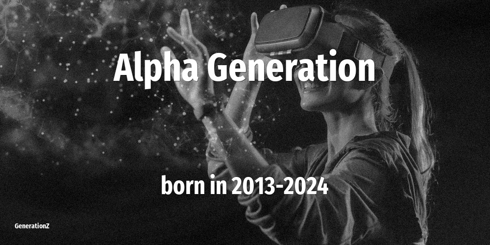

# Generations Explained — Lost Generation to Generation Alpha

As of 2026, the people alive today span roughly 1883 to 2024, grouped into 9 named generations. This site is a consolidated reference: birth-year ranges, notable people born in each cohort, memorable quotes, and the defining events of each generation's life stages.

## All generations at a glance

-   

    **[Generation Alpha](generations/generation-alpha/index.md)**

    Born 2013–2024 · 2–13 years old in 2026

-   

    **[Generation Z](generations/generation-z/index.md)**

    Born 1997–2012 · 14–29 years old in 2026

-   

    **[Generation Y](generations/millennials/index.md)**

    Born 1981–1996 · 30–45 years old in 2026

-   

    **[Generation X](generations/generation-x/index.md)**

    Born 1965–1980 · 46–61 years old in 2026

-   

    **[Baby Boomers](generations/baby-boomers/index.md)**

    Born 1946–1964 · 62–80 years old in 2026

-   

    **[Silent Generation](generations/silent-generation/index.md)**

    Born 1925–1945 · 81–101 years old in 2026

-   

    **[Greatest Generation](generations/greatest-generation/index.md)**

    Born 1914–1924 · 102–112 years old in 2026

-   

    **[Interbellum Generation](generations/interbellum-generation/index.md)**

    Born 1901–1913 · 113–125 years old in 2026

-   

    **[Lost Generation](generations/lost-generation/index.md)**

    Born 1883–1900 · 126–143 years old in 2026

## Explore

- [All generations](generations/index.md)
- [Compare two generations](compare/index.md)
- [Notable people A–Z](people/index.md)
- [Defining events](events/index.md)
- [Memorable quotes](quotes/index.md)
- [What generation am I?](what-generation-am-i/index.md)
- [What generation is someone born in a given year?](born-in/index.md)

----

_Last updated: 2026-06-04_
