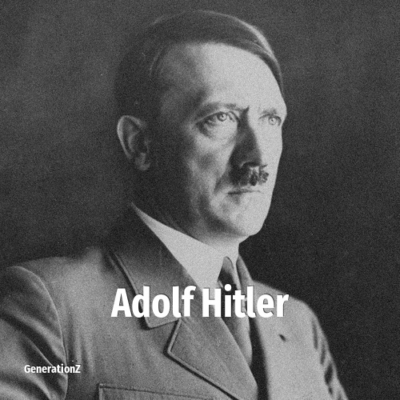

# Adolf Hitler

> **Adolf Hitler** was born in **1889**, making them a member of the Lost Generation. Field: Politics.

Adolf Hitler (20 April 1889 – 30 April 1945) was an Austrian-born German politician who was dictator of Germany in the Nazi era from 1933 until his suicide in 1945. He rose to power as the leader of the Nazi Party, becoming the chancellor of Germany in 1933 and then taking the title of Führer und Reichskanzler in 1934. Germany's invasion of Poland on 1 September 1939 under his leadership marked the outbreak of the Second World War. Throughout the ensuing conflict, Hitler was closely involved in the direction of German military operations and was central to the perpetration of the genocide of about six million Jews in the Holocaust as well as the deaths of millions of other victims.

## Facts

| | |
|---|---|
| Born | 1889 |
| Field | Politics |
| Country | Germany |
| Generation | [Lost Generation](../generations/lost-generation/index.md) |
| Born in | [Year 1889](../born-in/1889.md) |
| Wikipedia | [Adolf Hitler on Wikipedia](https://en.wikipedia.org/wiki/Adolf_Hitler) |
| IMDb | [Adolf Hitler on IMDb](https://www.imdb.com/name/nm0386944/) |

----

_Last updated: 2026-09-23_
