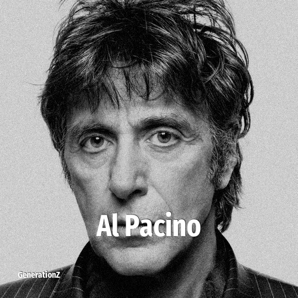

# Al Pacino

> **Al Pacino** was born in **1940**, making them a member of the Silent Generation. Field: Actor.

Alfredo James Pacino (born April 25, 1940) is an American actor. Known for his intense performances on stage and screen, Pacino is widely regarded as one of the greatest actors of all time. His career spans more than five decades, during which he has earned many accolades, achieving the Triple Crown of Acting by winning an Academy Award, a Tony Award, and an Emmy Award. He was honored with the Cecil B. DeMille Award in 2001, the AFI Life Achievement Award in 2007, the National Medal of Arts in 2011, the Kennedy Center Honors in 2016, and the Sam Wanamaker Award in 2026. A method actor, Pacino studied at HB Studio and the Actors Studio where he was taught by Charlie Laughton and Lee Strasberg. Films in which he has appeared have grossed over $3 billion worldwide.

## Facts

| | |
|---|---|
| Born | 1940 |
| Field | Actor |
| Country | USA |
| Generation | [Silent Generation](../generations/silent-generation/index.md) |
| Born in | [Year 1940](../born-in/1940.md) |
| Wikipedia | [Al Pacino on Wikipedia](https://en.wikipedia.org/wiki/Al_Pacino) |
| IMDb | [Al Pacino on IMDb](https://www.imdb.com/name/nm0000199/) |

----

_Last updated: 2026-09-23_
