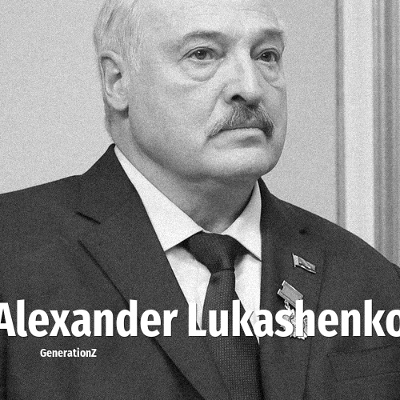

# Alexander Lukashenko

> **Alexander Lukashenko** was born in **1954**, making them a member of the Baby Boomers. Field: Politics.

Alexander Grigoryevich Lukashenko (also transliterated from Belarusian as Alyaksandr Ryhoravich Lukashenka; born 30 August 1954) is a Belarusian politician who has been the first and only president of Belarus since the office's establishment in 1994, making him the current longest-tenured European president.

## Facts

| | |
|---|---|
| Born | 1954 |
| Field | Politics |
| Country | Belarus |
| Generation | [Baby Boomers](../generations/baby-boomers/index.md) |
| Born in | [Year 1954](../born-in/1954.md) |
| Wikipedia | [Alexander Lukashenko on Wikipedia](https://en.wikipedia.org/wiki/Alexander_Lukashenko) |
| IMDb | [Alexander Lukashenko on IMDb](https://www.imdb.com/name/nm2603428/) |

----

_Last updated: 2026-09-24_
