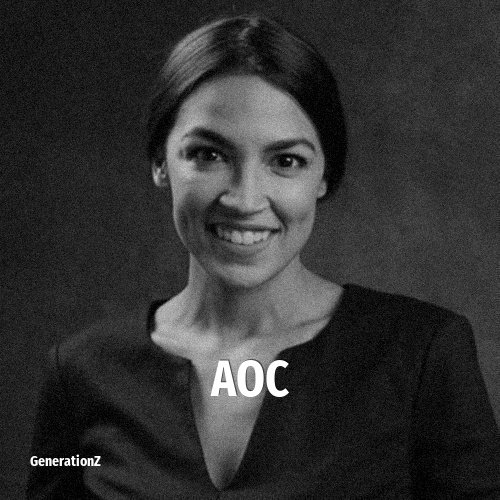

# Alexandria Ocasio-Cortez

> **Alexandria Ocasio-Cortez** was born in **1989**, making them a member of the Generation Y. Field: Politics.

Alexandria Ocasio-Cortez (born October 13, 1989), also known as AOC, is an American politician and activist who has served since 2019 as the U.S. representative for New York's 14th congressional district. She is a member of the Democratic Party and the Democratic Socialists of America.

## Facts

| | |
|---|---|
| Born | 1989 |
| Field | Politics |
| Country | USA |
| Generation | [Generation Y](../generations/millennials/index.md) |
| Born in | [Year 1989](../born-in/1989.md) |
| Wikipedia | [Alexandria Ocasio-Cortez on Wikipedia](https://en.wikipedia.org/wiki/Alexandria_Ocasio-Cortez) |
| IMDb | [Alexandria Ocasio-Cortez on IMDb](https://www.imdb.com/name/nm9936326/) |

----

_Last updated: 2026-09-23_
