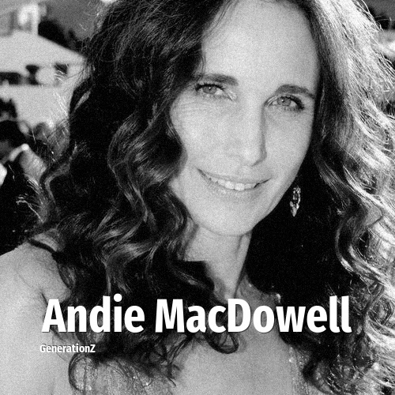

# Andie MacDowell

> **Andie MacDowell** was born in **1958**, making them a member of the Baby Boomers. Field: Actor.

Rosalie Anderson MacDowell (born April 21, 1958) is an American actress and former fashion model. MacDowell is known for her starring film roles in romantic comedies and dramas. She has modeled for Calvin Klein and has been a spokeswoman for L'Oréal since 1986.

## Facts

| | |
|---|---|
| Born | 1958 |
| Field | Actor |
| Country | USA |
| Generation | [Baby Boomers](../generations/baby-boomers/index.md) |
| Born in | [Year 1958](../born-in/1958.md) |
| Wikipedia | [Andie MacDowell on Wikipedia](https://en.wikipedia.org/wiki/Andie_MacDowell) |
| IMDb | [Andie MacDowell on IMDb](https://www.imdb.com/name/nm0000510/) |

----

_Last updated: 2026-09-24_
