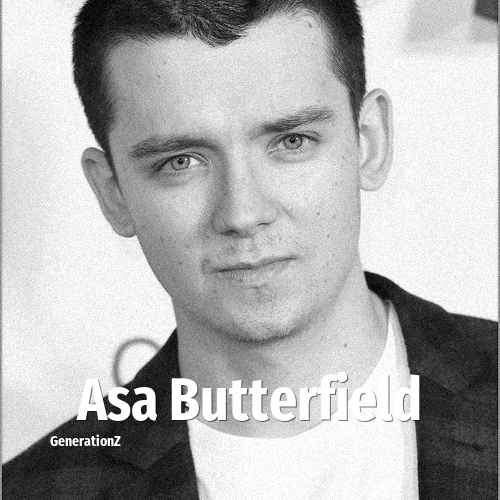

# Asa Butterfield

> **Asa Butterfield** was born in **1997**, making them a member of the Generation Z. Field: Actor.

Asa Bopp Farr Butterfield (born 1 April 1997) is an English actor. Beginning his career as a child actor, he first achieved recognition as the lead of the historical drama film The Boy in the Striped Pyjamas (2008). He continued to headline films during the 2010s, starring in the adventure drama Hugo (2011), the science-fiction film Ender's Game (2013), the drama X+Y (2014), the fantasy Miss Peregrine's Home for Peculiar Children (2016) and the romantic science-fiction The Space Between Us (2017). From 2019 to 2023, Butterfield portrayed the lead of the Netflix comedy-drama series Sex Education.

## Facts

| | |
|---|---|
| Born | 1997 |
| Field | Actor |
| Country | UK |
| Generation | [Generation Z](../generations/generation-z/index.md) |
| Born in | [Year 1997](../born-in/1997.md) |
| Wikipedia | [Asa Butterfield on Wikipedia](https://en.wikipedia.org/wiki/Asa_Butterfield) |
| IMDb | [Asa Butterfield on IMDb](https://www.imdb.com/name/nm2633535/) |

----

_Last updated: 2026-09-23_
