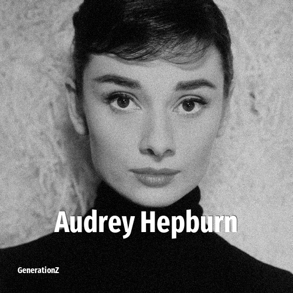

# Audrey Hepburn

> **Audrey Hepburn** was born in **1929**, making them a member of the Silent Generation. Field: Actor.

Audrey Kathleen Hepburn-Ruston (née Ruston; 4 May 1929 – 20 January 1993) was a British actress and humanitarian. Recognised as a film and fashion icon, she was ranked by the American Film Institute as the third-greatest female screen legend from the Classical Hollywood cinema. She was inducted into the International Best Dressed Hall of Fame and is one of only a few entertainers who have won competitive Academy, Emmy, Grammy and Tony Awards.

## Facts

| | |
|---|---|
| Born | 1929 |
| Field | Actor |
| Country | Belgium |
| Generation | [Silent Generation](../generations/silent-generation/index.md) |
| Born in | [Year 1929](../born-in/1929.md) |
| Wikipedia | [Audrey Hepburn on Wikipedia](https://en.wikipedia.org/wiki/Audrey_Hepburn) |
| IMDb | [Audrey Hepburn on IMDb](https://www.imdb.com/name/nm0000030/) |

----

_Last updated: 2026-09-23_
