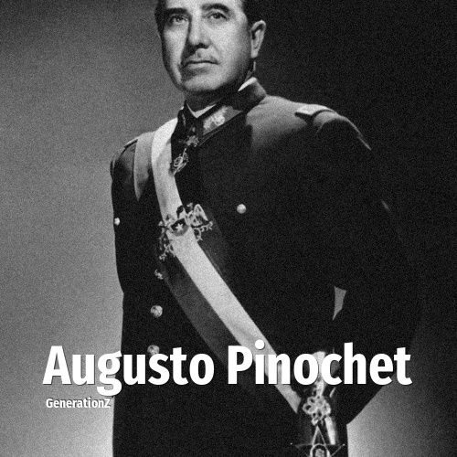

# Augusto Pinochet

> **Augusto Pinochet** was born in **1915**, making them a member of the Greatest Generation. Field: Politics.

Augusto José Ramón Pinochet Ugarte (25 November 1915 – 10 December 2006) was a Chilean army officer and military dictator who ruled Chile from 1973 to 1990. He led the Chilean Army in the overthrow of President Salvador Allende in 1973 and established a military junta. He was proclaimed President of Chile by the junta in 1974 and served until 1990, when he stepped down to pave the way for democratic elections. Throughout his presidency, thousands of political opponents were tortured or executed. Pinochet is the longest-serving head of state in the history of Chile.

## Facts

| | |
|---|---|
| Born | 1915 |
| Field | Politics |
| Country | Chile |
| Generation | [Greatest Generation](../generations/greatest-generation/index.md) |
| Born in | [Year 1915](../born-in/1915.md) |
| Wikipedia | [Augusto Pinochet on Wikipedia](https://en.wikipedia.org/wiki/Augusto_Pinochet) |
| IMDb | [Augusto Pinochet on IMDb](https://www.imdb.com/name/nm0684496/) |

----

_Last updated: 2026-09-24_
