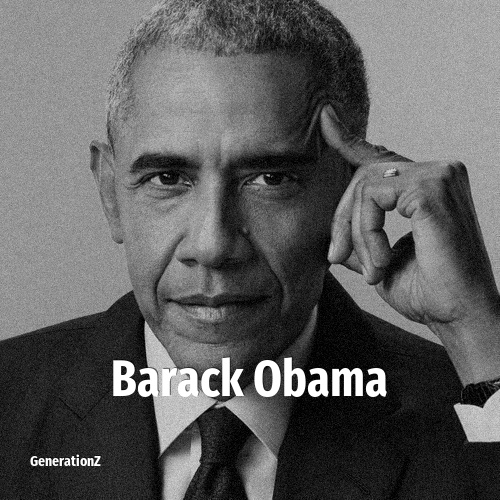

# Barack Obama

> **Barack Obama** was born in **1961**, making them a member of the Baby Boomers. Field: Politics.

Barack Hussein Obama II (born August 4, 1961) is an American retired politician who served as the 44th president of the United States from 2009 to 2017. A member of the Democratic Party, he was the first African American to serve as president. Obama represented Illinois in the United States Senate from 2005 to 2008 and served as an Illinois state senator from 1997 to 2004.

## Facts

| | |
|---|---|
| Born | 1961 |
| Field | Politics |
| Country | USA |
| Generation | [Baby Boomers](../generations/baby-boomers/index.md) |
| Born in | [Year 1961](../born-in/1961.md) |
| Wikipedia | [Barack Obama on Wikipedia](https://en.wikipedia.org/wiki/Barack_Obama) |
| IMDb | [Barack Obama on IMDb](https://www.imdb.com/name/nm1682433/) |

----

_Last updated: 2026-09-23_
