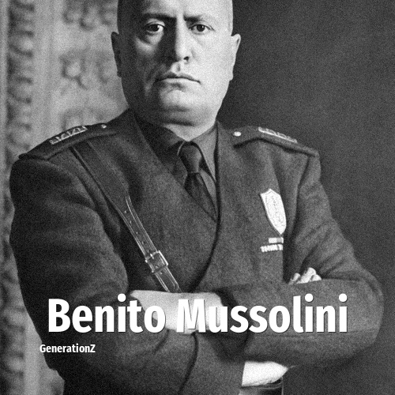

# Benito Mussolini

> **Benito Mussolini** was born in **1883**, making them a member of the Lost Generation. Field: Politics.

Benito Amilcare Andrea Mussolini (29 July 1883 – 28 April 1945) was an Italian politician, journalist, and dictator who led the Kingdom of Italy as a fascist dictatorship from 1922 until his overthrow in 1943. Known under his rule as Il Duce, he founded fascism in 1919 with the creation of the Fasci Italiani di Combattimento, which became the National Fascist Party in 1921. Mussolini was appointed Prime Minister of Italy after the March on Rome in 1922, establishing a totalitarian fascist dictatorship. He oversaw Italy's participation in World War II as a prominent member of the Axis Powers, and was executed by the Italian resistance near the end of the war in 1945.

## Facts

| | |
|---|---|
| Born | 1883 |
| Field | Politics |
| Country | Italy |
| Generation | [Lost Generation](../generations/lost-generation/index.md) |
| Born in | [Year 1883](../born-in/1883.md) |
| Wikipedia | [Benito Mussolini on Wikipedia](https://en.wikipedia.org/wiki/Benito_Mussolini) |
| IMDb | [Benito Mussolini on IMDb](https://www.imdb.com/name/nm0615907/) |

----

_Last updated: 2026-09-24_
