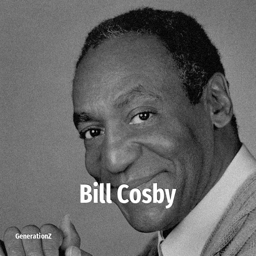

# Bill Cosby

> **Bill Cosby** was born in **1937**, making them a member of the Silent Generation. Field: Comedian.

William Henry Cosby Jr. (born July 12, 1937) is an American former comedian, actor, and media personality. Often deemed a trailblazer for African Americans in the entertainment industry, Cosby was well known in the United States for his stand-up comedy routines and television career before achieving global recognition for his portrayal of Cliff Huxtable in the sitcom The Cosby Show (1984–1992). He was also prolific in advertising for decades and was the recipient of numerous awards and honorary degrees throughout his career, many of which were revoked after dozens of allegations of sexual assault were made against him, starting in 2014 and culminating in a 2018 conviction for aggravated indecent assault.

## Facts

| | |
|---|---|
| Born | 1937 |
| Field | Comedian |
| Country | USA |
| Generation | [Silent Generation](../generations/silent-generation/index.md) |
| Born in | [Year 1937](../born-in/1937.md) |
| Wikipedia | [Bill Cosby on Wikipedia](https://en.wikipedia.org/wiki/Bill_Cosby) |
| IMDb | [Bill Cosby on IMDb](https://www.imdb.com/name/nm0001070/) |

----

_Last updated: 2026-09-23_
