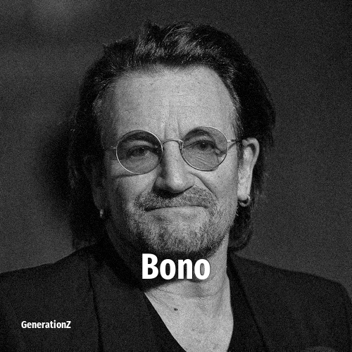

# Bono

> **Bono** was born in **1960**, making them a member of the Baby Boomers. Field: Musician.

Paul David Hewson (born 10 May 1960), known by the nickname Bono, is an Irish singer-songwriter and activist. He is a founding member, the lead vocalist, and primary lyricist of the rock band U2. Bono is known for his impassioned vocal style as well as his grandiose songwriting and performance style. His lyrics frequently include social and political themes, and religious imagery inspired by his Christian faith.

## Facts

| | |
|---|---|
| Born | 1960 |
| Field | Musician |
| Country | Ireland |
| Generation | [Baby Boomers](../generations/baby-boomers/index.md) |
| Born in | [Year 1960](../born-in/1960.md) |
| Wikipedia | [Bono on Wikipedia](https://en.wikipedia.org/wiki/Bono) |
| IMDb | [Bono on IMDb](https://www.imdb.com/name/nm0095104/) |

----

_Last updated: 2026-09-23_
