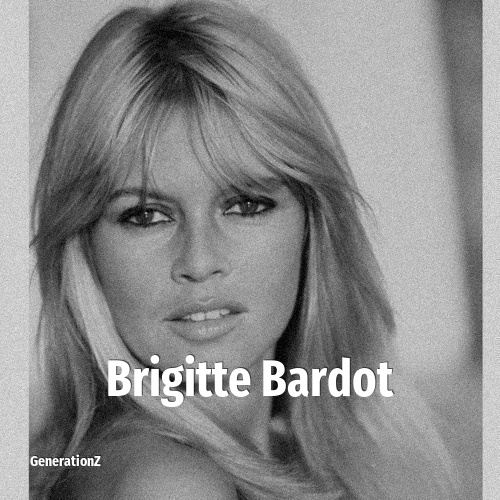

# Brigitte Bardot

> **Brigitte Bardot** was born in **1934**, making them a member of the Silent Generation. Field: Actor.

Brigitte Anne-Marie Bardot (28 September 1934 – 28 December 2025), often referred to by her initials B.B., was a French actress, singer, model, and animal rights activist. She became one of the best-known symbols of the sexual revolution and gained international fame for portraying characters associated with hedonistic lifestyles. Although she withdrew from the entertainment industry in 1973, she remained a major pop culture icon. She appeared in 47 films, performed in several musicals, and recorded more than 60 songs. She was awarded the Legion of Honour in 1985.

## Facts

| | |
|---|---|
| Born | 1934 |
| Field | Actor |
| Country | France |
| Generation | [Silent Generation](../generations/silent-generation/index.md) |
| Born in | [Year 1934](../born-in/1934.md) |
| Wikipedia | [Brigitte Bardot on Wikipedia](https://en.wikipedia.org/wiki/Brigitte_Bardot) |
| IMDb | [Brigitte Bardot on IMDb](https://www.imdb.com/name/nm0000003/) |

----

_Last updated: 2026-09-23_
