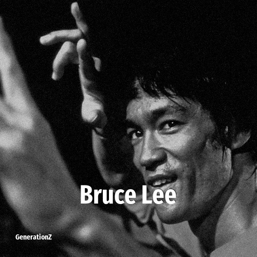

# Bruce Lee

> **Bruce Lee** was born in **1940**, making them a member of the Silent Generation. Field: Actor.

Bruce Lee (born Lee Jun-fan; November 27, 1940 – July 20, 1973) was a Hong Kong and American martial artist, actor, and filmmaker. He was the founder of Jeet Kune Do, a hybrid martial arts philosophy, which was formed from his experiences in unarmed fighting and self-defense—as well as eclectic, Zen Buddhist, and Taoist philosophies—as a new school of martial arts thought. With a career spanning Hong Kong and the United States, Lee is regarded as the first global Chinese film star and one of the most influential martial artists in the history of cinema. Known for the five feature-length martial arts films that he starred in as an adult, he is credited with helping to popularize martial arts films in the 1970s and promoting Hong Kong action cinema.

## Facts

| | |
|---|---|
| Born | 1940 |
| Field | Actor |
| Country | USA |
| Generation | [Silent Generation](../generations/silent-generation/index.md) |
| Born in | [Year 1940](../born-in/1940.md) |
| Wikipedia | [Bruce Lee on Wikipedia](https://en.wikipedia.org/wiki/Bruce_Lee) |
| IMDb | [Bruce Lee on IMDb](https://www.imdb.com/name/nm0000045/) |

----

_Last updated: 2026-09-23_
