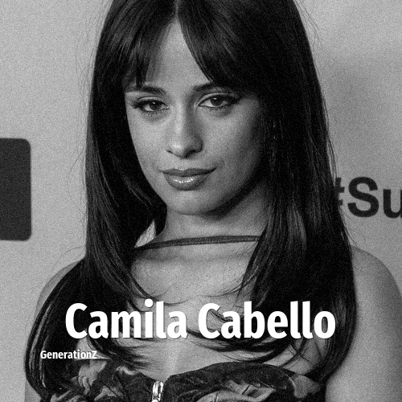

# Camila Cabello

> **Camila Cabello** was born in **1997**, making them a member of the Generation Z. Field: Musician.

Karla Camila Cabello Estrabao (born March 3, 1997) is an American singer and songwriter. She rose to prominence as a member of the girl group, Fifth Harmony, one of the best-selling girl groups of all time (16th). While in the group, Cabello established herself as a solo artist with collaborative singles "I Know What You Did Last Summer" (with Shawn Mendes) and "Bad Things" (with Machine Gun Kelly), the latter making number four on the US Billboard Hot 100. She left Fifth Harmony in late 2016.

## Facts

| | |
|---|---|
| Born | 1997 |
| Field | Musician |
| Country | USA |
| Generation | [Generation Z](../generations/generation-z/index.md) |
| Born in | [Year 1997](../born-in/1997.md) |
| Wikipedia | [Camila Cabello on Wikipedia](https://en.wikipedia.org/wiki/Camila_Cabello) |
| IMDb | [Camila Cabello on IMDb](https://www.imdb.com/name/nm5305981/) |

----

_Last updated: 2026-09-23_
