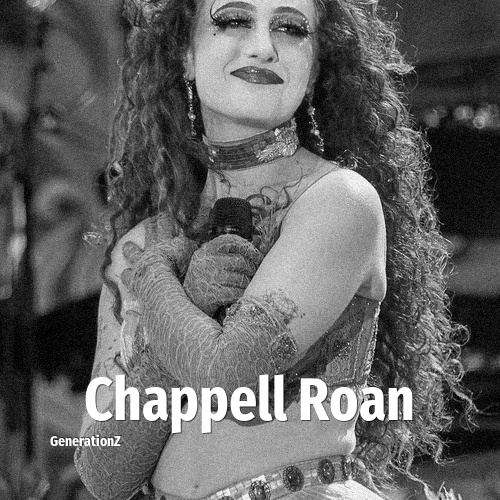

# Chappell Roan

> **Chappell Roan** was born in **1998**, making them a member of the Generation Z. Field: Musician.

Kayleigh Rose Amstutz (born February 19, 1998), known professionally as Chappell Roan, is an American singer and songwriter. She is known for her camp and drag queen–influenced style.

## Facts

| | |
|---|---|
| Born | 1998 |
| Field | Musician |
| Country | USA |
| Generation | [Generation Z](../generations/generation-z/index.md) |
| Born in | [Year 1998](../born-in/1998.md) |
| Wikipedia | [Chappell Roan on Wikipedia](https://en.wikipedia.org/wiki/Chappell_Roan) |
| IMDb | [Chappell Roan on IMDb](https://www.imdb.com/name/nm11490513/) |

----

_Last updated: 2026-09-24_
