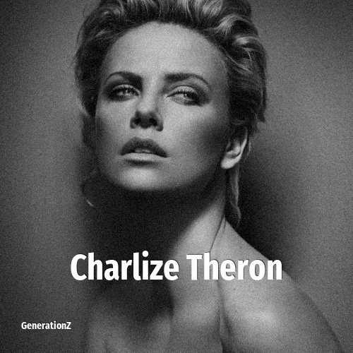

# Charlize Theron

> **Charlize Theron** was born in **1975**, making them a member of the Generation X. Field: Actor.

Charlize Theron (born 7 August 1975) is a South African and American actress and producer. One of the world's highest-paid actresses, her accolades include an Academy Award and a Golden Globe Award, in addition to nominations for three BAFTAs and two Emmy Awards.

## Facts

| | |
|---|---|
| Born | 1975 |
| Field | Actor |
| Country | Australia |
| Generation | [Generation X](../generations/generation-x/index.md) |
| Born in | [Year 1975](../born-in/1975.md) |
| Wikipedia | [Charlize Theron on Wikipedia](https://en.wikipedia.org/wiki/Charlize_Theron) |
| IMDb | [Charlize Theron on IMDb](https://www.imdb.com/name/nm0000234/) |

----

_Last updated: 2026-09-23_
