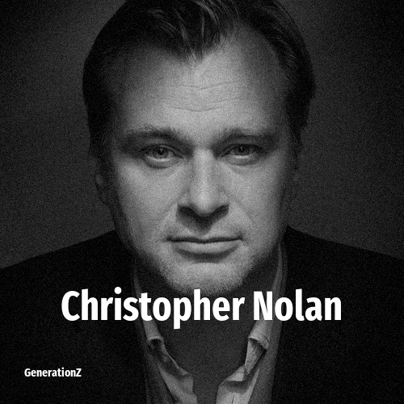

# Christopher Nolan

> **Christopher Nolan** was born in **1970**, making them a member of the Generation X. Field: Director.

Sir Christopher Edward Nolan (born 30 July 1970) is a British and American filmmaker. Known for his Hollywood blockbusters with complex storytelling, Nolan is considered a leading filmmaker of the 21st century. His films have earned over $7.7 billion worldwide, making him the third-highest-grossing film director of all time. Nolan's accolades include two Academy Awards, a Golden Globe Award, and two British Academy Film Awards. He was also appointed a Commander of the British Empire in 2019 and was knighted in 2024 for his contributions to film.

## Facts

| | |
|---|---|
| Born | 1970 |
| Field | Director |
| Country | UK |
| Generation | [Generation X](../generations/generation-x/index.md) |
| Born in | [Year 1970](../born-in/1970.md) |
| Wikipedia | [Christopher Nolan on Wikipedia](https://en.wikipedia.org/wiki/Christopher_Nolan) |
| IMDb | [Christopher Nolan on IMDb](https://www.imdb.com/name/nm0634240/) |

----

_Last updated: 2026-09-23_
