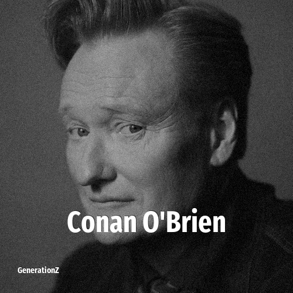

# Conan O'Brien

> **Conan O'Brien** was born in **1963**, making them a member of the Baby Boomers. Field: Comedian.

Conan Christopher O'Brien (born April 18, 1963) is an American television host, comedian, writer, actor, and podcaster. He hosted several late-night talk shows, beginning with Late Night with Conan O'Brien (1993–2009) and The Tonight Show with Conan O'Brien (2009–2010) on the NBC television network, and Conan (2010–2021) on the cable channel TBS. Before his hosting career, O'Brien was a writer for the NBC sketch comedy series Saturday Night Live from 1988 to 1991, and the Fox animated sitcom The Simpsons from 1991 to 1993. He has hosted the podcast series Conan O'Brien Needs a Friend since 2018, and starred in the travel show Conan O'Brien Must Go on HBO Max since 2024.

## Facts

| | |
|---|---|
| Born | 1963 |
| Field | Comedian |
| Country | USA |
| Generation | [Baby Boomers](../generations/baby-boomers/index.md) |
| Born in | [Year 1963](../born-in/1963.md) |
| Wikipedia | [Conan O'Brien on Wikipedia](https://en.wikipedia.org/wiki/Conan_O%27Brien) |
| IMDb | [Conan O'Brien on IMDb](https://www.imdb.com/name/nm0005277/) |

----

_Last updated: 2026-09-23_
