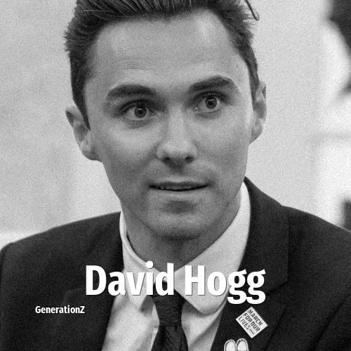

# David Hogg

> **David Hogg** was born in **2000**, making them a member of the Generation Z. Field: Politics.

David Miles Hogg (born April 12, 2000) is an American gun control activist who served as a co-vice chair of the Democratic National Committee from February to June 2025. As a student survivor of the Parkland high school shooting, he rose to prominence during the 2018 United States gun violence protests and his participation in the March for Our Lives organization, by helping lead several high-profile protests, marches, and boycotts, including the boycott of The Ingraham Angle. He has also been a target and scapegoat of several conspiracy theories.

## Facts

| | |
|---|---|
| Born | 2000 |
| Field | Politics |
| Country | USA |
| Generation | [Generation Z](../generations/generation-z/index.md) |
| Born in | [Year 2000](../born-in/2000.md) |
| Wikipedia | [David Hogg on Wikipedia](https://en.wikipedia.org/wiki/David_Hogg) |
| IMDb | [David Hogg on IMDb](https://www.imdb.com/name/nm9641890/) |

----

_Last updated: 2026-09-24_
