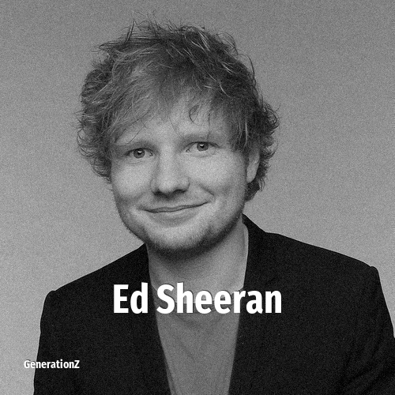

# Ed Sheeran

> **Ed Sheeran** was born in **1991**, making them a member of the Generation Y. Field: Musician.

Edward Christopher Sheeran (born 17 February 1991) is an English singer-songwriter. Born in Halifax, West Yorkshire, and raised in Framlingham, Suffolk, he began writing songs around the age of eleven. In early 2011, Sheeran independently released the extended play No.5 Collaborations Project. He signed with Asylum Records the same year.

## Facts

| | |
|---|---|
| Born | 1991 |
| Field | Musician |
| Country | UK |
| Generation | [Generation Y](../generations/millennials/index.md) |
| Born in | [Year 1991](../born-in/1991.md) |
| Wikipedia | [Ed Sheeran on Wikipedia](https://en.wikipedia.org/wiki/Ed_Sheeran) |
| IMDb | [Ed Sheeran on IMDb](https://www.imdb.com/name/nm3247828/) |

----

_Last updated: 2026-09-23_
