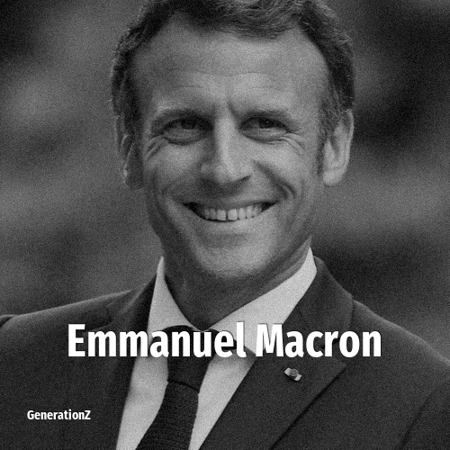

# Emmanuel Macron

> **Emmanuel Macron** was born in **1977**, making them a member of the Generation X. Field: Politics.

Emmanuel Jean-Michel Frédéric Macron (born 21 December 1977) is a French politician who has served as President of France since 2017. He has been a member of Renaissance since founding the party in 2016. Macron previously served as Deputy Secretary-General to the President from 2012 to 2014 and Minister of Economics and Finance from 2014 to 2016 under President François Hollande.

## Facts

| | |
|---|---|
| Born | 1977 |
| Field | Politics |
| Country | France |
| Generation | [Generation X](../generations/generation-x/index.md) |
| Born in | [Year 1977](../born-in/1977.md) |
| Wikipedia | [Emmanuel Macron on Wikipedia](https://en.wikipedia.org/wiki/Emmanuel_Macron) |
| IMDb | [Emmanuel Macron on IMDb](https://www.imdb.com/name/nm6960621/) |

----

_Last updated: 2026-09-23_
