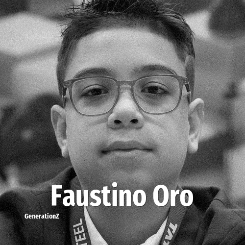

# Faustino Oro

> **Faustino Oro** was born in **2013**, making them a member of the Generation Alpha. Field: Sports.

Faustino Oro (born October 14, 2013) is an Argentine chess prodigy and grandmaster.

## Facts

| | |
|---|---|
| Born | 2013 |
| Field | Sports |
| Country | Argentina |
| Generation | [Generation Alpha](../generations/generation-alpha/index.md) |
| Born in | [Year 2013](../born-in/2013.md) |
| Wikipedia | [Faustino Oro on Wikipedia](https://en.wikipedia.org/wiki/Faustino_Oro) |

----

_Last updated: 2026-09-23_
