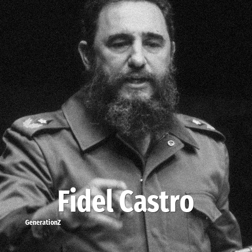

# Fidel Castro

> **Fidel Castro** was born in **1926**, making them a member of the Silent Generation. Field: Politics.

Fidel Alejandro Castro Ruz (13 August 1926 – 25 November 2016) was a Cuban communist revolutionary and politician who was the leader of Cuba from 1959 to 2011. He served as prime minister from 1959 to 1976, president from 1976 to 2008, and first secretary of the Communist Party of Cuba from 1965 until 2011. Ideologically a Marxist–Leninist and Cuban nationalist, under his administration Cuba became a one-party communist state; industry and business were nationalized, and socialist reforms were implemented throughout society.

## Facts

| | |
|---|---|
| Born | 1926 |
| Field | Politics |
| Country | Cuba |
| Generation | [Silent Generation](../generations/silent-generation/index.md) |
| Born in | [Year 1926](../born-in/1926.md) |
| Wikipedia | [Fidel Castro on Wikipedia](https://en.wikipedia.org/wiki/Fidel_Castro) |
| IMDb | [Fidel Castro on IMDb](https://www.imdb.com/name/nm0004242/) |

----

_Last updated: 2026-09-24_
