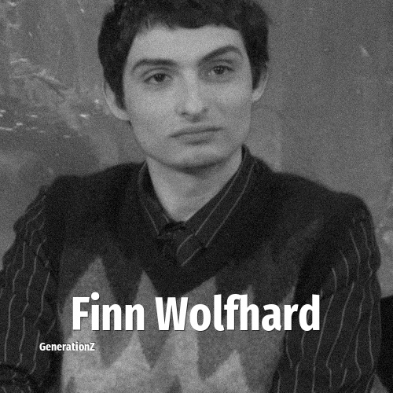

# Finn Wolfhard

> **Finn Wolfhard** was born in **2002**, making them a member of the Generation Z. Field: Actor.

Finn Michael Wolfhard (born December 23, 2002) is a Canadian actor, musician, and film director. He received international attention for playing Mike Wheeler on the Netflix series Stranger Things (2016–2025). He also played Richie Tozier in the horror film It (2017) and the sequel It Chapter Two (2019), and Trevor Spengler in the supernatural comedy Ghostbusters: Afterlife (2021) and its sequel Ghostbusters: Frozen Empire (2024).

## Facts

| | |
|---|---|
| Born | 2002 |
| Field | Actor |
| Country | Canada |
| Generation | [Generation Z](../generations/generation-z/index.md) |
| Born in | [Year 2002](../born-in/2002.md) |
| Wikipedia | [Finn Wolfhard on Wikipedia](https://en.wikipedia.org/wiki/Finn_Wolfhard) |
| IMDb | [Finn Wolfhard on IMDb](https://www.imdb.com/name/nm6016511/) |

----

_Last updated: 2026-09-24_
