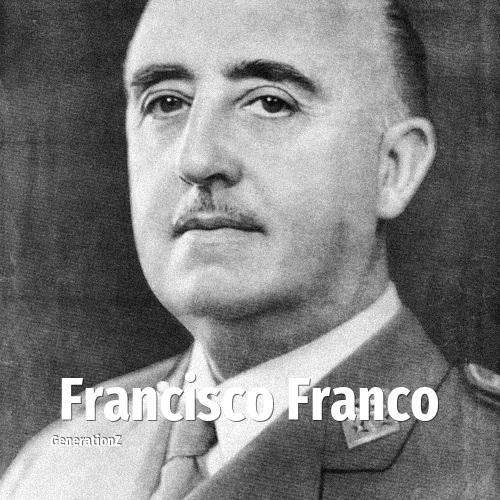

# Francisco Franco

> **Francisco Franco** was born in **1892**, making them a member of the Lost Generation. Field: Politics.

Francisco Franco Bahamonde (4 December 1892 – 20 November 1975) was a Spanish military general and politician who was the leader of Spain from 1939 until his death in 1975. He led the Nationalist forces in overthrowing the Second Spanish Republic during the Spanish Civil War from 1936 to 1939. This period in Spanish history, from the Nationalist victory to Franco's death, is commonly known as Francoist Spain.

## Facts

| | |
|---|---|
| Born | 1892 |
| Field | Politics |
| Country | Spain |
| Generation | [Lost Generation](../generations/lost-generation/index.md) |
| Born in | [Year 1892](../born-in/1892.md) |
| Wikipedia | [Francisco Franco on Wikipedia](https://en.wikipedia.org/wiki/Francisco_Franco) |
| IMDb | [Francisco Franco on IMDb](https://www.imdb.com/name/nm0290542/) |

----

_Last updated: 2026-09-24_
