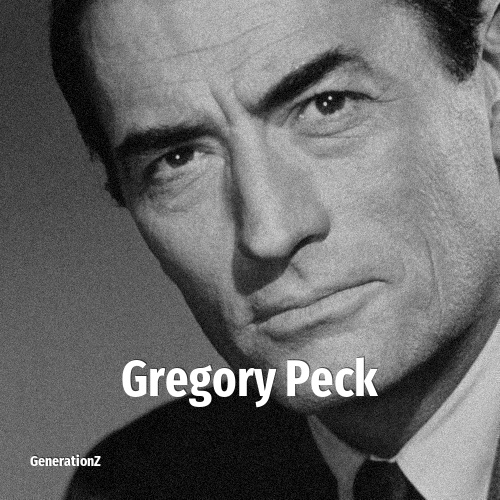

# Gregory Peck

> **Gregory Peck** was born in **1916**, making them a member of the Greatest Generation. Field: Actor.

Eldred Gregory Peck (April 5, 1916 – June 12, 2003) was an American actor. He was one of the most popular film stars from the 1940s to the 1970s. In 1999, the American Film Institute named Peck the 12th-greatest male star of Classic Hollywood Cinema.

## Facts

| | |
|---|---|
| Born | 1916 |
| Field | Actor |
| Country | USA |
| Generation | [Greatest Generation](../generations/greatest-generation/index.md) |
| Born in | [Year 1916](../born-in/1916.md) |
| Wikipedia | [Gregory Peck on Wikipedia](https://en.wikipedia.org/wiki/Gregory_Peck) |
| IMDb | [Gregory Peck on IMDb](https://www.imdb.com/name/nm0000060/) |

----

_Last updated: 2026-09-24_
