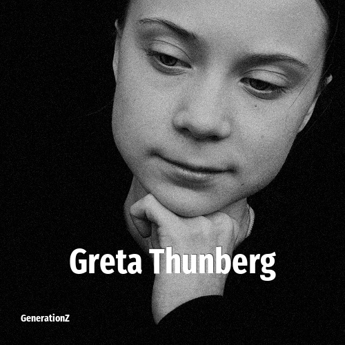

# Greta Thunberg

> **Greta Thunberg** was born in **2003**, making them a member of the Generation Z. Field: Politics.

Greta Tintin Eleonora Ernman Thunberg (born 3 January 2003) is a Swedish activist known for pressuring governments to address climate change and social issues. She gained global attention in 2018, at age 15, after starting a solo school strike outside the Swedish parliament, which inspired the worldwide Fridays for Future movement.

## Facts

| | |
|---|---|
| Born | 2003 |
| Field | Politics |
| Country | Sweden |
| Generation | [Generation Z](../generations/generation-z/index.md) |
| Born in | [Year 2003](../born-in/2003.md) |
| Wikipedia | [Greta Thunberg on Wikipedia](https://en.wikipedia.org/wiki/Greta_Thunberg) |
| IMDb | [Greta Thunberg on IMDb](https://www.imdb.com/name/nm10361418/) |

----

_Last updated: 2026-09-23_
