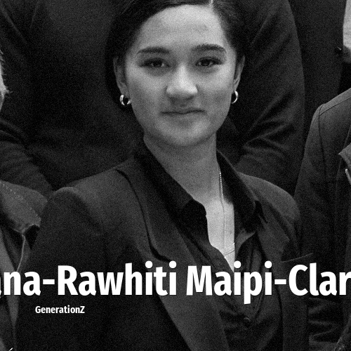

# Hana-Rawhiti Maipi-Clarke

> **Hana-Rawhiti Maipi-Clarke** was born in **2002**, making them a member of the Generation Z. Field: Politics.

Hana-Rawhiti Kareariki Maipi-Clarke (born 2002) is a New Zealand politician, representing Te Pāti Māori as a Member of Parliament since the 2023 New Zealand general election. She is the youngest MP since James Stuart-Wortley.

## Facts

| | |
|---|---|
| Born | 2002 |
| Field | Politics |
| Country | New Zealand |
| Generation | [Generation Z](../generations/generation-z/index.md) |
| Born in | [Year 2002](../born-in/2002.md) |
| Wikipedia | [Hana-Rawhiti Maipi-Clarke on Wikipedia](https://en.wikipedia.org/wiki/Hana-Rawhiti_Maipi-Clarke) |

----

_Last updated: 2026-09-24_
