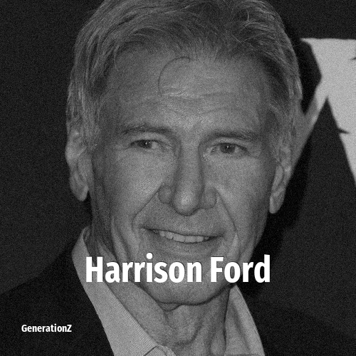

# Harrison Ford

> **Harrison Ford** was born in **1942**, making them a member of the Silent Generation. Field: Actor.

Harrison Ford (born July 13, 1942) is an American actor. Regarded as a cinematic cultural icon, Ford's accolades include nominations for an Academy Award, a British Academy Film Award, two Emmy Awards, five Golden Globes and two SAG-AFTRA's Actor Awards. He is also the recipient of the AFI Life Achievement Award, Cecil B. DeMille Award, Honorary César, Honorary Palme d'Or and SAG-AFTRA Life Achievement Award.

## Facts

| | |
|---|---|
| Born | 1942 |
| Field | Actor |
| Country | USA |
| Generation | [Silent Generation](../generations/silent-generation/index.md) |
| Born in | [Year 1942](../born-in/1942.md) |
| Wikipedia | [Harrison Ford on Wikipedia](https://en.wikipedia.org/wiki/Harrison_Ford) |
| IMDb | [Harrison Ford on IMDb](https://www.imdb.com/name/nm0000148/) |

----

_Last updated: 2026-09-23_
