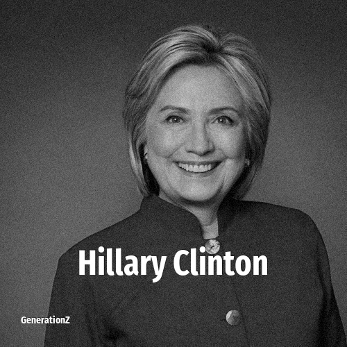

# Hillary Clinton

> **Hillary Clinton** was born in **1947**, making them a member of the Baby Boomers. Field: Politics.

Hillary Diane Rodham Clinton (née Rodham; born October 26, 1947) is an American politician, lawyer and diplomat. She was the 67th United States secretary of state in the administration of Barack Obama from 2009 to 2013, a U.S. senator representing New York from 2001 to 2009, and the first lady of the United States from 1993 to 2001 as the wife of Bill Clinton. A member of the Democratic Party, she was the party's nominee in the 2016 presidential election, becoming the first woman to win a presidential nomination by a major U.S. political party and the only woman to win the popular vote for U.S. president. Clinton lost the United States Electoral College vote to Republican Party nominee Donald Trump. She is the only first lady of the United States to have run for, or held, elected office.

## Facts

| | |
|---|---|
| Born | 1947 |
| Field | Politics |
| Country | USA |
| Generation | [Baby Boomers](../generations/baby-boomers/index.md) |
| Born in | [Year 1947](../born-in/1947.md) |
| Wikipedia | [Hillary Clinton on Wikipedia](https://en.wikipedia.org/wiki/Hillary_Clinton) |
| IMDb | [Hillary Clinton on IMDb](https://www.imdb.com/name/nm0166921/) |

----

_Last updated: 2026-09-23_
