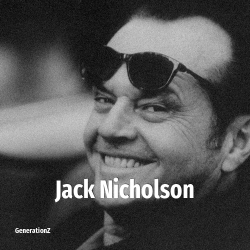

# Jack Nicholson

> **Jack Nicholson** was born in **1937**, making them a member of the Silent Generation. Field: Actor.

John Joseph Nicholson (born April 22, 1937) is an American retired actor and filmmaker. Nicholson is widely regarded as one of the greatest actors of the 20th century, often playing charismatic rebels fighting against the social structure. Over his five-decade-long career, he received numerous accolades, including three Academy Awards, three British Academy Film Awards, six Golden Globe Awards, and a Grammy Award.

## Facts

| | |
|---|---|
| Born | 1937 |
| Field | Actor |
| Country | USA |
| Generation | [Silent Generation](../generations/silent-generation/index.md) |
| Born in | [Year 1937](../born-in/1937.md) |
| Wikipedia | [Jack Nicholson on Wikipedia](https://en.wikipedia.org/wiki/Jack_Nicholson) |
| IMDb | [Jack Nicholson on IMDb](https://www.imdb.com/name/nm0000197/) |

----

_Last updated: 2026-09-24_
