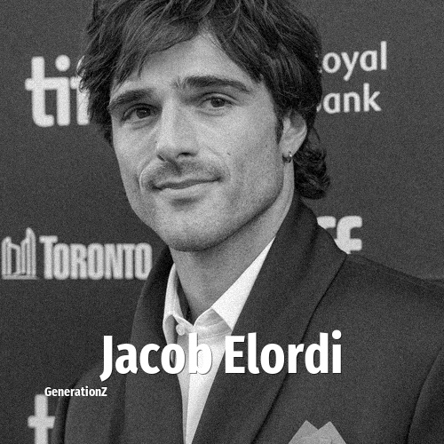

# Jacob Elordi

> **Jacob Elordi** was born in **1997**, making them a member of the Generation Z. Field: Actor.

Jacob Nathaniel Elordi (born 26 June 1997) is an Australian actor. His accolades include a Critics' Choice Award and three AACTA Awards, in addition to nominations for an Academy Award, three British Academy Film Awards and two Golden Globe Awards.

## Facts

| | |
|---|---|
| Born | 1997 |
| Field | Actor |
| Country | Australia |
| Generation | [Generation Z](../generations/generation-z/index.md) |
| Born in | [Year 1997](../born-in/1997.md) |
| Wikipedia | [Jacob Elordi on Wikipedia](https://en.wikipedia.org/wiki/Jacob_Elordi) |
| IMDb | [Jacob Elordi on IMDb](https://www.imdb.com/name/nm8624059/) |

----

_Last updated: 2026-09-23_
