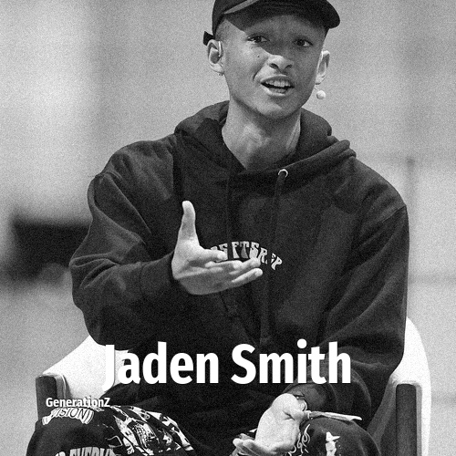

# Jaden Smith

> **Jaden Smith** was born in **1998**, making them a member of the Generation Z. Field: Actor.

Jaden Christopher Syre Smith (born July 8, 1998) is an American rapper, singer, songwriter, actor, and dancer. The son of Jada Pinkett-Smith and Will Smith, he made his film debut alongside his father in the 2006 film The Pursuit of Happyness, and appeared with his father once more in the film After Earth (2013). Smith also co-starred in the remake films The Day the Earth Stood Still (2008), alongside Keanu Reeves, and The Karate Kid (2010), with Jackie Chan. He is also known for his work in the two-part Netflix television series The Get Down (2016) and for voicing the character Kaz Kaan in the anime series, Neo Yokio.

## Facts

| | |
|---|---|
| Born | 1998 |
| Field | Actor |
| Country | USA |
| Generation | [Generation Z](../generations/generation-z/index.md) |
| Born in | [Year 1998](../born-in/1998.md) |
| Wikipedia | [Jaden Smith on Wikipedia](https://en.wikipedia.org/wiki/Jaden_Smith) |
| IMDb | [Jaden Smith on IMDb](https://www.imdb.com/name/nm1535523/) |

----

_Last updated: 2026-09-24_
