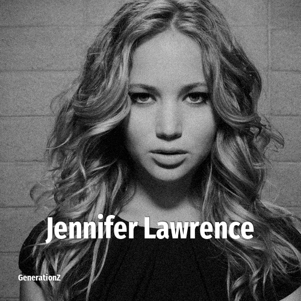

# Jennifer Lawrence

> **Jennifer Lawrence** was born in **1990**, making them a member of the Generation Y. Field: Actor.

Jennifer Shrader Maroney (née Lawrence; born August 15, 1990) is an American actress and producer. She has starred in both action film franchises and independent dramas, and her films have grossed over $6 billion worldwide. Lawrence was the world's highest-paid actress in 2015 and 2016 and Time named her one of the 100 most influential people in the world.

## Facts

| | |
|---|---|
| Born | 1990 |
| Field | Actor |
| Country | USA |
| Generation | [Generation Y](../generations/millennials/index.md) |
| Born in | [Year 1990](../born-in/1990.md) |
| Wikipedia | [Jennifer Lawrence on Wikipedia](https://en.wikipedia.org/wiki/Jennifer_Lawrence) |
| IMDb | [Jennifer Lawrence on IMDb](https://www.imdb.com/name/nm2225369/) |

----

_Last updated: 2026-09-23_
