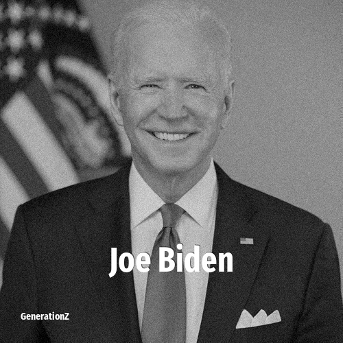

# Joe Biden

> **Joe Biden** was born in **1942**, making them a member of the Silent Generation. Field: Politics.

Joseph Robinette Biden Jr. (born November 20, 1942) is an American retired politician who served as the 46th president of the United States from 2021 to 2025. A member of the Democratic Party, he represented Delaware in the United States Senate from 1973 to 2009 and also served as the 47th vice president under President Barack Obama from 2009 to 2017.

## Facts

| | |
|---|---|
| Born | 1942 |
| Field | Politics |
| Country | USA |
| Generation | [Silent Generation](../generations/silent-generation/index.md) |
| Born in | [Year 1942](../born-in/1942.md) |
| Wikipedia | [Joe Biden on Wikipedia](https://en.wikipedia.org/wiki/Joe_Biden) |
| IMDb | [Joe Biden on IMDb](https://www.imdb.com/name/nm0081182/) |

----

_Last updated: 2026-09-24_
