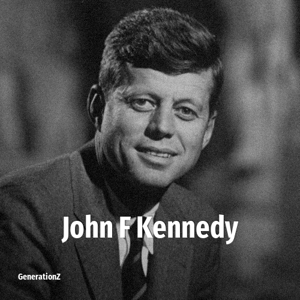

# John F Kennedy

> **John F Kennedy** was born in **1917**, making them a member of the Greatest Generation. Field: Politics.

John Fitzgerald Kennedy (May 29, 1917 – November 22, 1963), also known as JFK, was the 35th president of the United States, serving from 1961 until his assassination in 1963. He was the youngest person elected president, at 43 years, and the first Catholic president. Kennedy served at the height of the Cold War, and the majority of his foreign policy concerned relations with the Soviet Union and Cuba. A member of the Democratic Party, Kennedy represented Massachusetts in both houses of the United States Congress before his presidency.

## Facts

| | |
|---|---|
| Born | 1917 |
| Field | Politics |
| Country | USA |
| Generation | [Greatest Generation](../generations/greatest-generation/index.md) |
| Born in | [Year 1917](../born-in/1917.md) |
| Wikipedia | [John F Kennedy on Wikipedia](https://en.wikipedia.org/wiki/John_F._Kennedy) |
| IMDb | [John F Kennedy on IMDb](https://www.imdb.com/name/nm0448123/) |

----

_Last updated: 2026-09-23_
