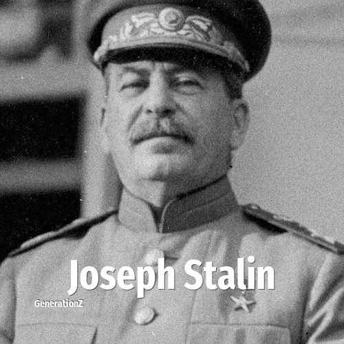

# Joseph Stalin

> **Joseph Stalin** was born in **1878**, making them outside the named generations on this site. Field: Politics.

Joseph Stalin (born Ioseb Besarionis dze Jughashvili; 18 December 1878 – 5 March 1953) was a Soviet politician and revolutionary who ruled the Soviet Union from 1922 until his death in 1953, holding the titles of General Secretary of the Communist Party of the Soviet Union from 1922 to 1952 and the nation's Premier from 1941 to 1953. Initially presiding over an oligarchic one-party system that governed by plurality, he became the de facto dictator of the Soviet Union by the 1930s. Ideologically committed to the Leninist interpretation of Marxism, Stalin helped to formalise these ideas as Marxism–Leninism, while his own policies became known as Stalinism.

## Facts

| | |
|---|---|
| Born | 1878 |
| Field | Politics |
| Country | Russia |
| Born in | [Year 1878](../born-in/1878.md) |
| Wikipedia | [Joseph Stalin on Wikipedia](https://en.wikipedia.org/wiki/Joseph_Stalin) |
| IMDb | [Joseph Stalin on IMDb](https://www.imdb.com/name/nm0821672/) |

----

_Last updated: 2026-09-24_
