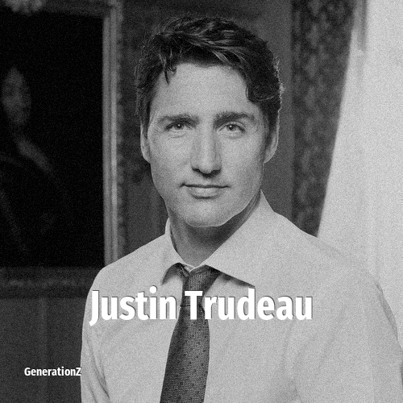

# Justin Trudeau

> **Justin Trudeau** was born in **1971**, making them a member of the Generation X. Field: Politics.

Justin Pierre James Trudeau (born December 25, 1971) is a Canadian politician who served as the 23rd prime minister of Canada from 2015 to 2025. He led the Liberal Party from 2013 until his resignation in 2025 and was the member of Parliament for Papineau from 2008 until 2025.

## Facts

| | |
|---|---|
| Born | 1971 |
| Field | Politics |
| Country | Canada |
| Generation | [Generation X](../generations/generation-x/index.md) |
| Born in | [Year 1971](../born-in/1971.md) |
| Wikipedia | [Justin Trudeau on Wikipedia](https://en.wikipedia.org/wiki/Justin_Trudeau) |
| IMDb | [Justin Trudeau on IMDb](https://www.imdb.com/name/nm0874040/) |

----

_Last updated: 2026-09-23_
