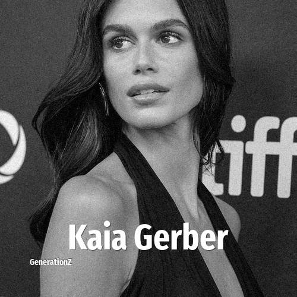

# Kaia Gerber

> **Kaia Gerber** was born in **2001**, making them a member of the Generation Z. Field: Model.

Kaia Jordan Gerber (born September 3, 2001) is an American model and actress. After starring in a series of ad campaigns for fashion brands since debuting at Fashion Week in 2017, Gerber won Model of the Year at the British Fashion Awards in 2018. As an actress, she has appeared in supporting roles in the films Bottoms (2023) and Saturday Night (2024), and starred in a lead role in the FX series The Shards. She is the second child and only daughter of supermodel Cindy Crawford and businessman Rande Gerber.

## Facts

| | |
|---|---|
| Born | 2001 |
| Field | Model |
| Country | USA |
| Generation | [Generation Z](../generations/generation-z/index.md) |
| Born in | [Year 2001](../born-in/2001.md) |
| Wikipedia | [Kaia Gerber on Wikipedia](https://en.wikipedia.org/wiki/Kaia_Gerber) |
| IMDb | [Kaia Gerber on IMDb](https://www.imdb.com/name/nm7333021/) |

----

_Last updated: 2026-09-23_
