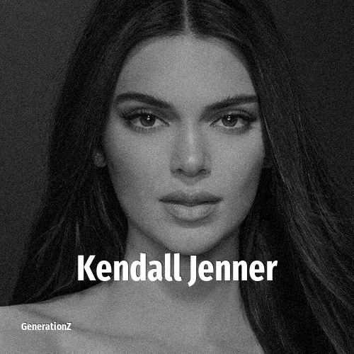

# Kendall Jenner

> **Kendall Jenner** was born in **1995**, making them a member of the Generation Y. Field: Personality.

Kendall Nicole Jenner (born November 3, 1995) is an American model, socialite, and media personality. She rose to fame in the reality television show Keeping Up with the Kardashians, in which she starred for 20 seasons and nearly 15 years from 2007 to 2021. The success of the show led to the creation of multiple spin-off series including Kourtney and Khloe Take Miami (2009), Kourtney and Kim Take New York (2011), Khloé & Lamar (2011), Rob & Chyna (2016) and Life of Kylie (2017). Following the decision to end their reality show, in 2022 she and her family starred in the reality television series The Kardashians on Hulu.

## Facts

| | |
|---|---|
| Born | 1995 |
| Field | Personality |
| Country | USA |
| Generation | [Generation Y](../generations/millennials/index.md) |
| Born in | [Year 1995](../born-in/1995.md) |
| Wikipedia | [Kendall Jenner on Wikipedia](https://en.wikipedia.org/wiki/Kendall_Jenner) |
| IMDb | [Kendall Jenner on IMDb](https://www.imdb.com/name/nm2832525/) |

----

_Last updated: 2026-09-24_
